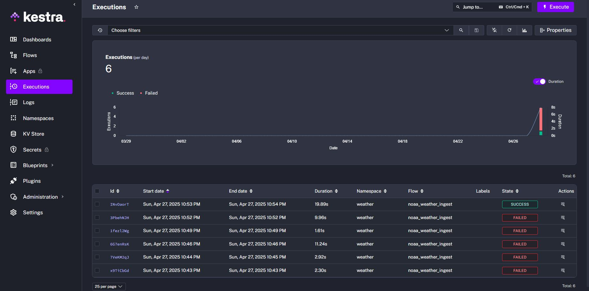
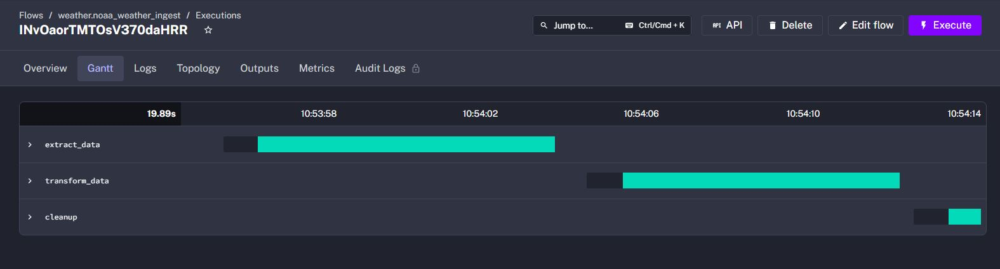
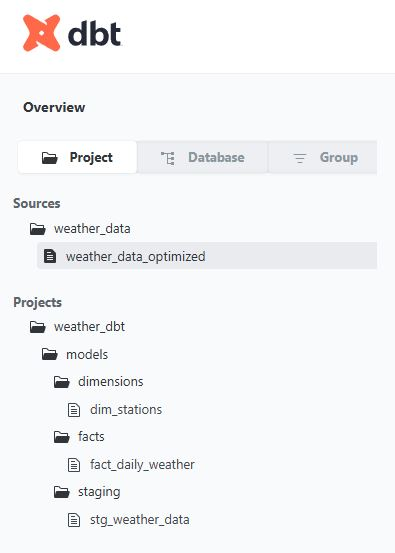
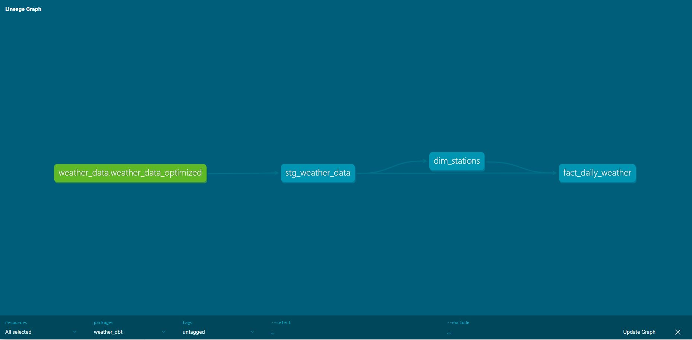
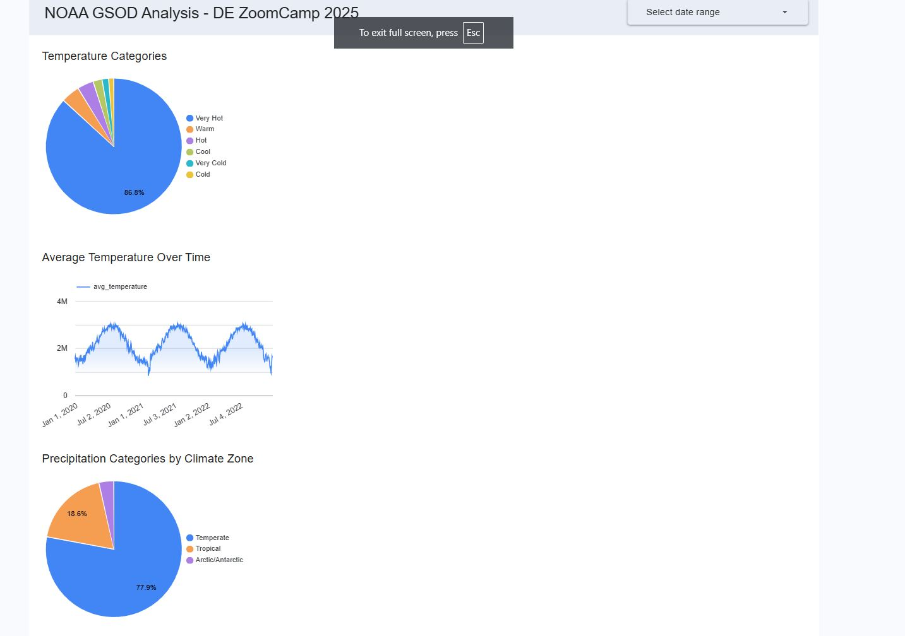
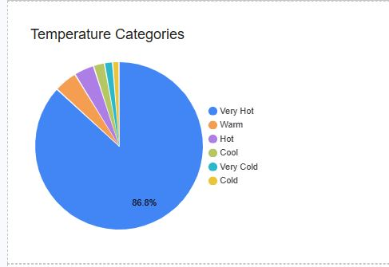
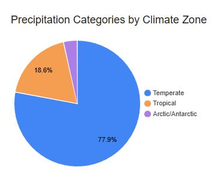

# NOAA Weather Data Analysis Pipeline

## Project Overview

**Project Title:** NOAA Weather Data Analysis Pipeline: Understanding Global Weather Patterns

**Objective:** This project builds an end-to-end data pipeline that processes NOAA Global Summary of Day (GSOD) weather data to identify climate patterns, analyze weather anomalies, and visualize weather metrics for better understanding of global weather trends.

## Problem Description

Weather data is critical for understanding climate patterns and their impacts on various aspects of society, from agriculture to transportation. However, raw weather data is often complex, voluminous, and difficult to analyze without proper processing. This project addresses these challenges by:

1. Creating an optimized data structure for efficient queries
2. Providing insights into weather patterns across different climate zones
3. Identifying anomalies and extreme weather events
4. Visualizing temporal trends and categorical distributions of weather data

## Technology Stack

| Component | Technology | Description |
|-----------|------------|-------------|
| **Cloud Platform** | Google Cloud Platform | Managed services for scalable data processing |
| **IaC** | Terraform | Infrastructure as code for GCP resource provisioning |
| **Data Lake** | BigQuery | Used for both raw and processed data storage |
| **Data Warehouse** | BigQuery | SQL-based analytics database with partitioning/clustering |
| **Workflow Orchestration** | Kestra on GKE | Containerized workflow orchestration on Kubernetes |
| **Transformations** | dbt | Data transformation and modeling |
| **Dashboard** | Looker Studio | Visualization of weather insights |
| **Languages** | SQL, YAML, Terraform HCL | For transformations, workflows, and infrastructure |

## Project Architecture


*[Architecture diagram showing the data flow from source through transformation to visualization]*

The architecture follows these key steps:
1. Infrastructure provisioning with Terraform (GKE, BigQuery, IAM)
2. Extract data from public NOAA dataset in BigQuery using Kestra running on GKE
3. Process and transform data using BigQuery and store in optimized tables
4. Model data using dbt for analytical purposes
5. Visualize insights using Looker Studio dashboards

## Project Components

### 1. Infrastructure (Terraform)

Terraform is used to provision and manage the GCP resources:
- BigQuery datasets (temp_dataset, weather_analysis, weather_dataset)
- Google Kubernetes Engine (GKE) cluster for Kestra
- Service accounts with appropriate IAM permissions

Key Terraform files:
- `main.tf`: Main infrastructure definition including GKE setup
- `variables.tf`: Variable definitions for project ID and region

**Terraform apply output (snippet):**

```bash
[calvin@devsjc terraform]$ export PROJECT_ID=de-zoomcamp-p3-gsod

[calvin@devsjc terraform]$ terraform apply -var="project_id=de-zoomcamp-p3-gsod" -var="region=us-central1"
google_service_account.pipeline_service_account: Creating...
google_bigquery_dataset.temp_dataset: Creating...
google_storage_bucket.data_lake: Creating...
google_bigquery_dataset.weather_dataset: Creating...
google_storage_bucket.kestra_storage: Creating...
google_bigquery_dataset.weather_dataset: Creation complete after 0s [id=projects/de-zoomcamp-p3-gsod/datasets/weather_analysis]
google_bigquery_dataset.temp_dataset: Creation complete after 0s [id=projects/de-zoomcamp-p3-gsod/datasets/temp_dataset]
google_storage_bucket.kestra_storage: Creation complete after 1s [id=de-zoomcamp-p3-gsod-kestra]
google_storage_bucket_object.kestra_workflow: Creating...
google_storage_bucket.data_lake: Creation complete after 1s [id=de-zoomcamp-p3-gsod-datalake]
google_storage_bucket_object.kestra_workflow: Creation complete after 0s [id=de-zoomcamp-p3-gsod-kestra-workflows/noaa_weather_ingest.yml]
google_service_account.pipeline_service_account: Still creating... [10s elapsed]
google_service_account.pipeline_service_account: Creation complete after 12s [id=projects/de-zoomcamp-p3-gsod/serviceAccounts/weather-pipeline-sa@de-zoomcamp-p3-gsod.iam.gserviceaccount.com]
google_project_iam_binding.storage_admin: Creating...
google_project_iam_binding.bigquery_admin: Creating...
google_container_cluster.kestra_cluster: Creating...
google_project_iam_binding.bigquery_admin: Creation complete after 8s [id=de-zoomcamp-p3-gsod/roles/bigquery.admin]
google_project_iam_binding.storage_admin: Creation complete after 8s [id=de-zoomcamp-p3-gsod/roles/storage.admin]
google_container_cluster.kestra_cluster: Still creating... [10s elapsed]
google_container_cluster.kestra_cluster: Still creating... [20s elapsed]
google_container_cluster.kestra_cluster: Still creating... [30s elapsed]
google_container_cluster.kestra_cluster: Still creating... [40s elapsed]
google_container_cluster.kestra_cluster: Still creating... [50s elapsed]
google_container_cluster.kestra_cluster: Still creating... [1m0s elapsed]
google_container_cluster.kestra_cluster: Still creating... [1m10s elapsed]
google_container_cluster.kestra_cluster: Still creating... [1m20s elapsed]
google_container_cluster.kestra_cluster: Still creating... [1m30s elapsed]
google_container_cluster.kestra_cluster: Still creating... [1m40s elapsed]
google_container_cluster.kestra_cluster: Still creating... [1m50s elapsed]
google_container_cluster.kestra_cluster: Still creating... [2m0s elapsed]
google_container_cluster.kestra_cluster: Still creating... [2m10s elapsed]
google_container_cluster.kestra_cluster: Still creating... [2m20s elapsed]
google_container_cluster.kestra_cluster: Still creating... [2m30s elapsed]
google_container_cluster.kestra_cluster: Still creating... [2m40s elapsed]
google_container_cluster.kestra_cluster: Still creating... [2m50s elapsed]
google_container_cluster.kestra_cluster: Still creating... [3m0s elapsed]
google_container_cluster.kestra_cluster: Still creating... [3m10s elapsed]
google_container_cluster.kestra_cluster: Still creating... [3m20s elapsed]
google_container_cluster.kestra_cluster: Still creating... [3m30s elapsed]
google_container_cluster.kestra_cluster: Still creating... [3m40s elapsed]
google_container_cluster.kestra_cluster: Still creating... [3m50s elapsed]
google_container_cluster.kestra_cluster: Still creating... [4m0s elapsed]
google_container_cluster.kestra_cluster: Still creating... [4m10s elapsed]
google_container_cluster.kestra_cluster: Still creating... [4m20s elapsed]
google_container_cluster.kestra_cluster: Still creating... [4m30s elapsed]
google_container_cluster.kestra_cluster: Still creating... [4m40s elapsed]
google_container_cluster.kestra_cluster: Still creating... [4m50s elapsed]
google_container_cluster.kestra_cluster: Still creating... [5m0s elapsed]
google_container_cluster.kestra_cluster: Still creating... [5m10s elapsed]
google_container_cluster.kestra_cluster: Still creating... [5m20s elapsed]
google_container_cluster.kestra_cluster: Still creating... [5m30s elapsed]
google_container_cluster.kestra_cluster: Creation complete after 5m31s [id=projects/de-zoomcamp-p3-gsod/locations/us-central1/clusters/kestra-cluster]

Apply complete! Resources: 9 added, 0 changed, 0 destroyed.

Outputs:

gcs_bucket = "de-zoomcamp-p3-gsod-datalake"
gke_cluster = "kestra-cluster"
gke_command = "gcloud container clusters get-credentials kestra-cluster --region us-central1 --project de-zoomcamp-p3-gsod"
kestra_install_commands = <<EOT
# Get cluster credentials
gcloud container clusters get-credentials kestra-cluster --region us-central1 --project de-zoomcamp-p3-gsod

# Install Kestra using Helm
helm repo add kestra https://kestra-io.github.io/helm-charts
helm repo update
helm install kestra kestra/kestra \
  --set env.config.kestra.storage.type=gcs \
  --set env.config.kestra.storage.gcs.bucket=de-zoomcamp-p3-gsod-kestra \
  --set env.config.kestra.variables.gcp.project=de-zoomcamp-p3-gsod \
  --set env.config.kestra.variables.gcp.serviceAccount=weather-pipeline-sa@de-zoomcamp-p3-gsod.iam.gserviceaccount.com


NAME: kestra
LAST DEPLOYED: Sun Apr 27 22:21:39 2025
NAMESPACE: default
STATUS: deployed
REVISION: 1
TEST SUITE: None
NOTES:
1. Get the application URL by running these commands:
  export POD_NAME=$(kubectl get pods --namespace default -l "app.kubernetes.io/name=kestra,app.kubernetes.io/instance=kestra,app.kubernetes.io/component=standalone" -o jsonpath="{.items[0].metadata.name}")
  echo "Visit http://127.0.0.1:8080 to use your application"
  kubectl port-forward --namespace default $POD_NAME 8080:8080
  

# Create a service to access the UI
kubectl expose deployment kestra --type=LoadBalancer --name=kestra-ui --port=8080

# Get the external IP (this may take a minute)
kubectl get service kestra-ui

# Wait until you see an external IP, then import the workflow
export KESTRA_URL=$(kubectl get service kestra-ui -o jsonpath='{.status.loadBalancer.ingress[0].ip}'):8080
curl -X POST "http://$KESTRA_URL/api/v1/flows/import" -H "Content-Type: application/yaml" --data-binary @<(gsutil cat gs://de-zoomcamp-p3-gsod-kestra/workflows/noaa_weather_ingest.yml)

# Execute the workflow
curl -X POST "http://$KESTRA_URL/api/v1/executions" -H "Content-Type: application/json" -d '{"namespace":"weather","flowId":"noaa_weather_ingest"}'

EOT
kestra_storage_bucket = "de-zoomcamp-p3-gsod-kestra"
service_account = "weather-pipeline-sa@de-zoomcamp-p3-gsod.iam.gserviceaccount.com"
```

### 2. Kubernetes Deployment for Kestra

The project uses a GKE cluster to run Kestra for workflow orchestration:
- Single-node GKE cluster with e2-medium machine type
- Helm chart for Kestra deployment
- LoadBalancer service to expose the Kestra UI

**Snippet of GKE Cluster:**
```bash
(.venv) [calvin@devsjc DE-ZoomCamp]$ gcloud container clusters describe kestra-cluster --region=us-central1
addonsConfig:
  gcePersistentDiskCsiDriverConfig:
    enabled: true
  kubernetesDashboard:
    disabled: true
  networkPolicyConfig:
    disabled: true
autopilot: {}
autoscaling:
  autoscalingProfile: BALANCED
binaryAuthorization: {}
clusterIpv4Cidr: 10.4.0.0/14
controlPlaneEndpointsConfig:
  dnsEndpointConfig:
    allowExternalTraffic: false
    endpoint: gke-75caa7fbdd624651ae8f8534d56f2dc2111a-292021135316.us-central1.gke.goog
  ipEndpointsConfig:
    authorizedNetworksConfig:
      gcpPublicCidrsAccessEnabled: true
    enablePublicEndpoint: true
    enabled: true
    privateEndpoint: 10.128.0.2
    publicEndpoint: 34.59.217.xx
createTime: '2025-04-28T02:09:11+00:00'
currentMasterVersion: 1.32.2-gke.1182003
currentNodeCount: 3
currentNodeVersion: 1.32.2-gke.1182003
databaseEncryption:
  currentState: CURRENT_STATE_DECRYPTED
  state: DECRYPTED
defaultMaxPodsConstraint:
  maxPodsPerNode: '110'
endpoint: 34.59.217.143
enterpriseConfig:
  clusterTier: STANDARD
etag: 52e82870-5074-44eb-9ffa-e62c6390620f
id: 75caa7fbdd624651ae8f8534d56f2dc2111a1aa50f5042268c1ca4cbb76c0193
initialClusterVersion: 1.32.2-gke.1182003
initialNodeCount: 1
instanceGroupUrls:
- https://www.googleapis.com/compute/v1/projects/de-zoomcamp-p3-gsod/zones/us-central1-c/instanceGroupManagers/gke-kestra-cluster-default-pool-2eb2e5a6-grp
- https://www.googleapis.com/compute/v1/projects/de-zoomcamp-p3-gsod/zones/us-central1-f/instanceGroupManagers/gke-kestra-cluster-default-pool-723a1c4d-grp
- https://www.googleapis.com/compute/v1/projects/de-zoomcamp-p3-gsod/zones/us-central1-a/instanceGroupManagers/gke-kestra-cluster-default-pool-da610606-grp
ipAllocationPolicy:
  clusterIpv4Cidr: 10.4.0.0/14
  clusterIpv4CidrBlock: 10.4.0.0/14
  clusterSecondaryRangeName: gke-kestra-cluster-pods-75caa7fb
  defaultPodIpv4RangeUtilization: 0.0029
  podCidrOverprovisionConfig: {}
  servicesIpv4Cidr: 34.118.224.0/20
  servicesIpv4CidrBlock: 34.118.224.0/20
  stackType: IPV4
  useIpAliases: true
labelFingerprint: 78cdf2f6
legacyAbac: {}
location: us-central1
locations:
- us-central1-c
- us-central1-f
- us-central1-a
loggingConfig:
  componentConfig:
    enableComponents:
    - SYSTEM_COMPONENTS
    - WORKLOADS
loggingService: logging.googleapis.com/kubernetes
maintenancePolicy:
  resourceVersion: e3b0c442
masterAuth:
  clientCertificateConfig: {}
  clusterCaCertificate: LS0tLS1CRUdJTiBDRVJUSUZJQ0FURS0tLS0tCk1JSUVMVENDQXBXZ0F3SUJBZ0lSQUlySGlHbk55aVFnQmpWWFlBYytpTE13RFFZSktvWklodmNOQVFFTEJRQXcKTHpFdE1Dc0dBMVVFQXhNa056UTBPVGsyTlRndE9HVmhNaTAwTURFNExUZ3daR1V0WVRkaE1qSmpaVFZpTlRrMQpNQ0FYRFRJMU1EUXlPREF4TURreE1sb1lEekl3TlRVd05ESXhNREl3T1RFeVdqQXZNUzB3S3dZRFZRUURFeVEzCk5EUTVPVFkxT0MwNFpXRXlMVFF3TVRndE9EQmtaUzFoTjJFeU1tTmxOV0kxT1RVd2dnR2lNQTBHQ1NxR1NJYjMKRFFFQkFRVUFBNElCandBd2dnR0tBb0lCZ1FDcTIxOHZTR1BLU1ppWGNXWGExc0tYUWhmekpOaUV1dWQ1OUxvWgpLNlNWalhzcnNDSzNUQWl6NnFMZzllbUVta2M1UW5BN0Y0UGhRaXhHcXIranhaS0xyclIzZWlWd3lFSVlUeVV4CmIzUllITHJtSDIzdFcvbTRpZmdIYmxsL1A3cElZdVJLYmhRK2tKNE43S1dwMzJDMmk2Ym9NSW1NbU55VEJJZjMKV0gxYjRaRUx3bmlVZkhRZWlCdi8wYjhGbkNjdDFWb1ZzVXV1UkNxTzl4eEFuV0Fyd05Fc1cwKzV2bTdVcW5PWQpoV1FaMlErMVZPRUREK1Y0N3VxZXlrbFZOVjZPYktrN3JDOEU0c09LcXJMSVJTenN5VG05MkRsaDNSVVF0alhFClRkc2tKbUhvQjRmMGtwQ3VmSGFlNS9VNGlVUmxjSUxZaDZqOW5UK2w0dml1TFR2N09jeGVjYXk1OGVUVXZrMUcKa0ZER1pWanBtMS9UTXpzMWpwMzJrc0t5Q3ppazJpOXB4Z2FGb2QySjVIaHZOQUVvbmtxQzBnRTBRblF1b29ueApiZjY2M1pKaXQrcitlOU5EbkUxdTViaVpUQ1JwTkFkdGROcDhhdHZGTXBUQjhsUHhTRktuaEcwbmY4MWlpK2xBCnVNcElSM0ZBaWk4NDNRc2RWWk5WSXY4MU05OENBd0VBQWFOQ01FQXdEZ1lEVlIwUEFRSC9CQVFEQWdJRU1BOEcKQTFVZEV3RUIvd1FGTUFNQkFmOHdIUVlEVlIwT0JCWUVGRXNFRUJPdWxoN0txejBzNFVwNU5JMkZJaUJpTUEwRwpDU3FHU0liM0RRRUJDd1VBQTRJQmdRQmhDbkIrY1VKSERVUW41NU9pdDJKbWxSY3g4RDhvTlpoUnNXeXVzVXhuCmVyMUloWUtvNE54NUY3OTdiL1AzdUU1anY0UGJRUFI2K0JvTHVscVF0Y21WdDVRYlRyK29iL04vTmVKZ01leVgKNXgrSDBYdnBVSU5PZW9zL1JxdGRQdUFPT0U0QlovMDJLQjRLQlFhU2NzbEsrZVhwZG5KQzBuWEhPN0w2cUZMWQoveXJsdU8xNDB1SUkzd095SS81N0Z3VmVRZEpqKzBIMWFPV2FqR0tmSDAxTDFzMnV1MTNSMDdoTUJjeDNoTEUvCmNIc1QwTFpJTUdvNDBkVDBtc2dJeCtCb2ZMK0hsNTR1NjNGaElmRjZDdXlsRWlPbU5wZmtzcmk1dkxaNUNxN0QKbXlQQ2taVGkzU3Y2S0diMjVPdDJLL3JiLzNScFhmclF4bjEwUTlBNHRXTkZRRHlIUTFLbGxvTS81OWRTZEJOTwpSOTA1QWVFVGI0ckwrZU10RXNSeSt3cGkxSmhWdjBJb3ZidE0wdFQrTGs4Um5yNTIxdmFMaWdxZ0ZaZ3JBSndwCkd0OTVwL3h2Y3J0c1ZKK2dJaDhuaHBuTWtGenVUUVNlaThCRFI1Q2plMExwN2xWVytFSm1CRG0wQ0NRaVdibngKK1Y1WDhISkk4YlFseWphQUxIYVFrVjQ9Ci0tLS0tRU5EIENFUlRJRklDQVRFLS0tLS0K
masterAuthorizedNetworksConfig:
  gcpPublicCidrsAccessEnabled: true
monitoringConfig:
  advancedDatapathObservabilityConfig: {}
  componentConfig:
    enableComponents:
    - SYSTEM_COMPONENTS
    - DAEMONSET
    - DEPLOYMENT
    - STATEFULSET
    - JOBSET
    - STORAGE
    - HPA
    - POD
    - CADVISOR
    - KUBELET
    - DCGM
  managedPrometheusConfig:
    enabled: true
monitoringService: monitoring.googleapis.com/kubernetes
name: kestra-cluster
network: default
networkConfig:
  defaultSnatStatus: {}
  network: projects/de-zoomcamp-p3-gsod/global/networks/default
  serviceExternalIpsConfig: {}
  subnetwork: projects/de-zoomcamp-p3-gsod/regions/us-central1/subnetworks/default
nodeConfig:
  diskSizeGb: 50
  diskType: pd-standard
  effectiveCgroupMode: EFFECTIVE_CGROUP_MODE_V2
  imageType: COS_CONTAINERD
  kubeletConfig:
    insecureKubeletReadonlyPortEnabled: false
  loggingConfig: {}
  machineType: e2-medium
  metadata:
    disable-legacy-endpoints: 'true'
  oauthScopes:
  - https://www.googleapis.com/auth/cloud-platform
  resourceLabels:
    goog-gke-node-pool-provisioning-model: on-demand
  serviceAccount: weather-pipeline-sa@de-zoomcamp-p3-gsod.iam.gserviceaccount.com
  shieldedInstanceConfig:
    enableIntegrityMonitoring: true
  windowsNodeConfig: {}
nodePoolAutoConfig:
  nodeKubeletConfig:
    insecureKubeletReadonlyPortEnabled: false
nodePoolDefaults:
  nodeConfigDefaults:
    loggingConfig:
      variantConfig:
        variant: DEFAULT
    nodeKubeletConfig:
      insecureKubeletReadonlyPortEnabled: false
nodePools:
- config:
    diskSizeGb: 50
    diskType: pd-standard
    effectiveCgroupMode: EFFECTIVE_CGROUP_MODE_V2
    imageType: COS_CONTAINERD
    kubeletConfig:
      insecureKubeletReadonlyPortEnabled: false
    loggingConfig: {}
    machineType: e2-medium
    metadata:
      disable-legacy-endpoints: 'true'
    oauthScopes:
    - https://www.googleapis.com/auth/cloud-platform
    resourceLabels:
      goog-gke-node-pool-provisioning-model: on-demand
    serviceAccount: weather-pipeline-sa@de-zoomcamp-p3-gsod.iam.gserviceaccount.com
    shieldedInstanceConfig:
      enableIntegrityMonitoring: true
    windowsNodeConfig: {}
  etag: d0191034-811d-4566-8d4d-fa496a4190fd
  initialNodeCount: 1
  instanceGroupUrls:
  - https://www.googleapis.com/compute/v1/projects/de-zoomcamp-p3-gsod/zones/us-central1-c/instanceGroupManagers/gke-kestra-cluster-default-pool-2eb2e5a6-grp
  - https://www.googleapis.com/compute/v1/projects/de-zoomcamp-p3-gsod/zones/us-central1-f/instanceGroupManagers/gke-kestra-cluster-default-pool-723a1c4d-grp
  - https://www.googleapis.com/compute/v1/projects/de-zoomcamp-p3-gsod/zones/us-central1-a/instanceGroupManagers/gke-kestra-cluster-default-pool-da610606-grp
  locations:
  - us-central1-c
  - us-central1-f
  - us-central1-a
  management:
    autoRepair: true
    autoUpgrade: true
  maxPodsConstraint:
    maxPodsPerNode: '110'
  name: default-pool
  networkConfig:
    podIpv4CidrBlock: 10.4.0.0/14
    podIpv4RangeUtilization: 0.0029
    podRange: gke-kestra-cluster-pods-75caa7fb
  podIpv4CidrSize: 24
  selfLink: https://container.googleapis.com/v1/projects/de-zoomcamp-p3-gsod/locations/us-central1/clusters/kestra-cluster/nodePools/default-pool
  status: RUNNING
  upgradeSettings:
    maxSurge: 1
    strategy: SURGE
  version: 1.32.2-gke.1182003
notificationConfig:
  pubsub: {}
podAutoscaling:
  hpaProfile: HPA_PROFILE_UNSPECIFIED
privateClusterConfig:
  privateEndpoint: 10.128.0.2
  publicEndpoint: 34.59.217.XX
rbacBindingConfig:
  enableInsecureBindingSystemAuthenticated: true
  enableInsecureBindingSystemUnauthenticated: true
releaseChannel:
  channel: REGULAR
resourceLabels:
  goog-terraform-provisioned: 'true'
satisfiesPzi: false
satisfiesPzs: false
securityPostureConfig:
  mode: BASIC
  vulnerabilityMode: VULNERABILITY_MODE_UNSPECIFIED
selfLink: https://container.googleapis.com/v1/projects/de-zoomcamp-p3-gsod/locations/us-central1/clusters/kestra-cluster
servicesIpv4Cidr: 34.118.224.0/20
shieldedNodes:
  enabled: true
status: RUNNING
subnetwork: default
zone: us-central1
```

### 3. Data Pipeline (Kestra)

Kestra orchestrates the workflow that:
1. Extracts data from the public NOAA GSOD dataset in BigQuery
2. Transforms and filters the data to handle invalid entries
3. Loads the processed data into optimized BigQuery tables with appropriate partitioning and clustering

Workflow files:
- `noaa_weather_ingest.yml`: Main workflow definition with three key tasks:
  - Extract: Query public NOAA dataset
  - Transform: Create optimized table with derived fields
  - Cleanup: Remove temporary resources

**Screenshot:**



### 4. Data Transformations (dbt)

dbt models transform the already optimized data from Kestra into an analytical layer:
- Staging views that source from the optimized BigQuery table
- Dimension tables for stations with climate zone classification
- Fact tables for daily weather metrics with full analytical capabilities

Model files:
- `models/staging/stg_weather_data.sql`: Initial data staging
- `models/dimensions/dim_stations.sql`: Station information with climate zones
- `models/facts/fact_daily_weather.sql`: Complete fact table with all metrics

**Screenshot:**



### 5. Analytics (BigQuery)

Our data pipeline creates several optimized tables in BigQuery:
- `temp_dataset.noaa_weather_raw`: Temporary extraction table
- `weather_analysis.weather_data_optimized`: Kestra-transformed data
- `weather_dataset.dim_stations`: dbt dimension table with climate zones
- `weather_dataset.fact_daily_weather`: dbt fact table with full analytical capabilities

The table structure enables efficient querying with:
- Partitioning by month
- Clustering by station_id
- Derived categorical fields for temperature and precipitation

**BigQuery datasets:**
```bash
(.venv) [calvin@devsjc DE-ZoomCamp]$ bq ls
     datasetId      
 ------------------ 
  temp_dataset      
  weather_analysis  
  weather_dataset   
```

### 6. Visualization (Looker Studio)

A Looker Studio dashboard with:
- A categorical distribution
   - pie chart of temperature categories
   - precipitation categories by climate zone
- A temporal trend (line chart of average temperatures over time)

**Link: ** (https://lookerstudio.google.com/reporting/51297cd7-9a7e-4350-bed8-340771325a2a/page/hnTIF)
**Screenshot:**





## Setup Instructions

### Prerequisites

- GCP account with billing enabled
- Local installation of:
  - Terraform (v1.0.0+)
  - Google Cloud SDK with kubectl
  - Helm (for Kestra deployment)
  - dbt (v1.0.0+)

### Step 1: Deploy Infrastructure with Terraform

```bash
# Clone the repository
git clone https://github.com/hypertoast/clean-de-zoomcamp-2025.git
cd terraform

# Initialize Terraform
terraform init

# Deploy the infrastructure
terraform apply -var="project_id=your-project-id" -var="region=us-central1"
```
This creates:

- BigQuery datasets
- GKE cluster
- Service accounts
- Storage buckets

### Step 2: Deploy Kestra on GKE
After Terraform completes, deploy Kestra to the GKE cluster:

```bash
# Get credentials for the GKE cluster
gcloud container clusters get-credentials kestra-cluster --region us-central1 --project your-project-id

# Add the Kestra Helm repository
helm repo add kestra https://kestra-io.github.io/helm-charts
helm repo update

# Install Kestra using Helm
helm install kestra kestra/kestra \
  --set env.config.kestra.storage.type=gcs \
  --set env.config.kestra.storage.gcs.bucket=your-project-id-kestra \
  --set env.config.kestra.variables.gcp.project=your-project-id \
  --set env.config.kestra.variables.gcp.serviceAccount=weather-pipeline-sa@your-project-id.iam.gserviceaccount.com

# Expose the Kestra UI
kubectl expose pod $(kubectl get pods -l "app.kubernetes.io/name=kestra,app.kubernetes.io/component=standalone" -o jsonpath="{.items[0].metadata.name}") --type=LoadBalancer --name=kestra-ui --port=8080

# Get the external IP (this may take a minute)
kubectl get service kestra-ui
```

### Step 3: Import and Run the Kestra Workflow
Once Kestra is running:

1. Access the Kestra UI at the external IP address (http://EXTERNAL_IP:8080)
2. Create a new flow
3. Copy the contents of noaa_weather_ingest.yml (replacing project ID references)
4. Save and execute the workflow

### Step 4: Set Up and Run dbt
After the Kestra workflow successfully creates the optimized weather table:

```bash
# Install dbt with BigQuery adapter
pip install dbt-bigquery

# Initialize a new dbt project
dbt init weather_dbt
cd weather_dbt

# Configure profiles.yml for BigQuery connection
# Copy model files to the correct directories

# Run dbt models
dbt run
```


### Step 5: Create Looker Studio Dashboard

1. Go to Looker Studio
2. Create a new report
3. Connect to your BigQuery table (weather_dataset.fact_daily_weather)
4. Create visualizations:

- Temperature trends line chart
- Weather category distribution
- Station map
- Precipitation analysis

## Implementation Details
GKE Cluster for Kestra
The project uses a GKE cluster specifically configured for running Kestra:

- Single-node e2-medium instance for cost efficiency
- Standard persistent disk instead of SSD to stay within quota limits
- Service account with appropriate permissions for BigQuery and GCS
- Helm chart for simplified Kestra deployment
- LoadBalancer service for easy UI access

## BigQuery Optimization
The data warehouse uses several optimization techniques:

- Partitioning by month to improve query performance on time-based analysis
- Clustering by station_id for efficient filtering by location
- Categorical fields to simplify analysis of weather patterns
- Climate zone derivation for regional analysis

## dbt Data Modeling
The dbt implementation follows a layered approach:

- Staging layer: Clean and prepare data from the source
- Dimension layer: Create climate zone classifications for stations
- Fact layer: Combine all metrics with dimensions for analysis

## Project Results
The project successfully processes and analyzes NOAA weather data from 2020-2022, providing insights through:
Data Volume and Processing

- Processed over 44 million weather records from thousands of stations worldwide
- Organized data by climate zones and time periods for efficient querying
- Reduced query costs through appropriate partitioning and clustering

## Key Insights

- Identified significant temperature variations across climate zones
- Analyzed precipitation patterns and their seasonal distribution
- Created categorized weather metrics for simplified analysis

## Visualization Highlights

- Temperature trends over time by climate zone
- Distribution of precipitation categories
- Weather station distribution map

## Lessons Learned

- Successfully implemented a complete cloud-based data engineering pipeline
- Deployed and managed containerized workflow orchestration on Kubernetes
- Optimized BigQuery tables for efficient analysis
- Created a multi-layered transformation approach with both Kestra and dbt
- Developed effective visualizations that communicate key insights

## Future Enhancements

- Add real-time weather data streaming using Pub/Sub and Dataflow
- Implement machine learning models for weather prediction
- Expand analysis to include more weather metrics
- Incorporate other datasets (e.g., climate change indicators)

## References

- NOAA Global Summary of Day (GSOD) Dataset
- BigQuery Documentation
- Kestra Documentation
- dbt Documentation
- GKE Documentation