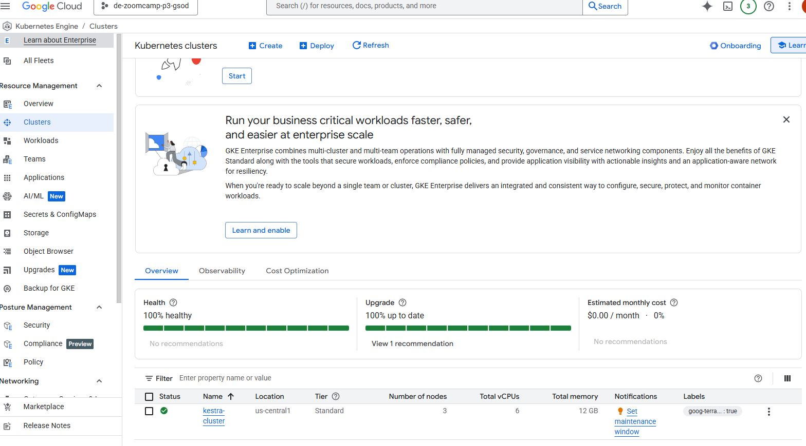
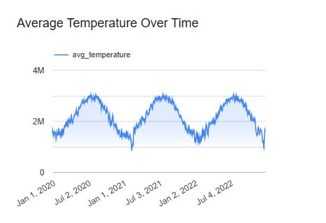

# NOAA Weather Data Analysis Pipeline

## TL;DR

This project builds an end-to-end data pipeline on Google Cloud Platform that processes NOAA Global Summary of Day (GSOD) weather data, optimizes it in BigQuery, and visualizes climate patterns through an interactive Looker Studio dashboard. The pipeline uses Terraform for infrastructure, Kestra for workflow orchestration, and dbt for transformations.

## Table of Contents

- [Project Overview](#project-overview)
- [Problem Description](#problem-description)
- [Technology Stack](#technology-stack)
- [Project Architecture](#project-architecture)
- [Project Components](#project-components)
  - [Infrastructure (Terraform)](#1-infrastructure-terraform)
  - [Kubernetes Deployment for Kestra](#2-kubernetes-deployment-for-kestra)
  - [Data Pipeline (Kestra)](#3-data-pipeline-kestra)
  - [Data Transformations (dbt)](#4-data-transformations-dbt)
  - [Analytics (BigQuery)](#5-analytics-bigquery)
  - [Visualization (Looker Studio)](#6-visualization-looker-studio)
- [Project Structure](#project-structure)
- [Setup Instructions](#setup-instructions)
- [Implementation Details](#implementation-details)
- [Performance Metrics](#performance-metrics)
- [Security Considerations](#security-considerations)
- [Project Results](#project-results)
- [Troubleshooting](#troubleshooting)
- [Future Enhancements](#future-enhancements)
- [References](#references)

## Project Overview

**Project Title:** NOAA Weather Data Analysis Pipeline: Understanding Global Weather Patterns

**Objective:** This project builds an end-to-end data pipeline that processes NOAA Global Summary of Day (GSOD) weather data to identify climate patterns, analyze weather anomalies, and visualize weather metrics for better understanding of global weather trends.

## Problem Description

Weather data is critical for understanding climate patterns and their impacts on various aspects of society, from agriculture to transportation. However, raw weather data is often complex, voluminous, and difficult to analyze without proper processing. This project addresses these challenges by:

1. Creating an optimized data structure for efficient queries
2. Providing insights into weather patterns across different climate zones
3. Identifying anomalies and extreme weather events
4. Visualizing temporal trends and categorical distributions of weather data

## Technology Stack

| Component | Technology | Description |
|-----------|------------|-------------|
| **Cloud Platform** | Google Cloud Platform | Managed services for scalable data processing |
| **IaC** | Terraform | Infrastructure as code for GCP resource provisioning |
| **Data Lake** | BigQuery | Used for both raw and processed data storage |
| **Data Warehouse** | BigQuery | SQL-based analytics database with partitioning/clustering |
| **Workflow Orchestration** | Kestra on GKE | Containerized workflow orchestration on Kubernetes |
| **Transformations** | dbt | Data transformation and modeling |
| **Dashboard** | Looker Studio | Visualization of weather insights |
| **Languages** | SQL, YAML, Terraform HCL | For transformations, workflows, and infrastructure |

## Project Architecture

The architecture follows these key steps:
1. Infrastructure provisioning with Terraform (GKE, BigQuery, IAM)
2. Extract data from public NOAA dataset in BigQuery using Kestra running on GKE
3. Process and transform data using BigQuery and store in optimized tables
4. Model data using dbt for analytical purposes
5. Visualize insights using Looker Studio dashboards


### NOAA Weather Data Analysis Pipeline Architecture Explanation
This architecture diagram illustrates the complete data flow of your NOAA weather analysis project, focusing on the key components and their interactions:
1. Infrastructure Layer

Terraform provisions and manages all the GCP resources, including BigQuery datasets, GCS buckets, and service accounts with appropriate IAM permissions.

2. Data Sourcing

Public NOAA GSOD Dataset: Available in BigQuery as the source of weather data.

3. Data Extraction & Processing

Kestra Workflow Orchestration: Running on Google Kubernetes Engine (GKE)

- The extract_data task queries the NOAA public dataset
- Data flows to a temporary storage in BigQuery (temp_dataset.noaa_weather_raw)
- The transform_data task applies initial transformations, categorizations, and optimizations
- The cleanup task removes temporary data

4. Data Storage & Warehousing

Google Cloud Storage: Acts as a temporary data lake for the pipeline
BigQuery: Serves as the data warehouse with optimized tables (partitioned by month and clustered by station_id, latitude, longitude)

5. Data Modeling

dbt: Handles advanced transformations, creating:

- Staging views
- Dimension tables (stations, time periods)
- Fact tables (daily weather metrics)

6. Data Visualization

Looker Studio: Creates interactive dashboards showing:

- Categorical distribution of weather conditions
- Temporal analysis of temperature trends

### Key Benefits of This Architecture:

- Fully Managed Services: Relies on GCP's managed services, reducing operational overhead
- Scalability: Can handle large volumes of weather data efficiently
- Optimization: Tables are partitioned and clustered for query performance
- Reproducibility: Infrastructure as code ensures consistent deployment
- Orchestration: Kestra manages the workflow dependencies and scheduling

This architecture follows data engineering best practices with clear separation of concerns between extraction, storage, transformation, and visualization layers.

## Project Structure

```
noaa-weather-pipeline/
├── terraform/                  # Infrastructure as code
│   ├── main.tf                 # Main Terraform configuration
│   ├── variables.tf            # Variable definitions
├── kestra/                     # Workflow orchestration
│   └── workflows/
│       └── noaa_weather_ingest.yml  # Data ingestion workflow
├── dbt/weather_dbt                        # Data transformation
│   ├── models/
│   │   ├── staging/
│   │   │   └── stg_weather_data.sql
│   │   ├── dimensions/
│   │   │   └── dim_stations.sql
│   │   └── facts/
│   │       └── fact_daily_weather.sql
│   ├── dbt_project.yml
│   └── profiles.yml
├── images/                     # Documentation images
│   ├── Architecture.JPG
│   ├── GKE.JPG
│   └── ...
└── README.md                   # This file
```

## Project Components

### 1. Infrastructure (Terraform)

Terraform is used to provision and manage the GCP resources:
- BigQuery datasets (temp_dataset, weather_analysis, weather_dataset)
- Google Kubernetes Engine (GKE) cluster for Kestra
- Service accounts with appropriate IAM permissions

Key Terraform files:
- `main.tf`: Main infrastructure definition including GKE setup
- `variables.tf`: Variable definitions for project ID and region

**Terraform apply output (snippet):**

```bash
[calvin@devsjc terraform]$ export PROJECT_ID=de-zoomcamp-p3-gsod

[calvin@devsjc terraform]$ terraform apply -var="project_id=de-zoomcamp-p3-gsod" -var="region=us-central1"
google_service_account.pipeline_service_account: Creating...
google_bigquery_dataset.temp_dataset: Creating...
google_storage_bucket.data_lake: Creating...
google_bigquery_dataset.weather_dataset: Creating...
google_storage_bucket.kestra_storage: Creating...
google_bigquery_dataset.weather_dataset: Creation complete after 0s [id=projects/de-zoomcamp-p3-gsod/datasets/weather_analysis]
google_bigquery_dataset.temp_dataset: Creation complete after 0s [id=projects/de-zoomcamp-p3-gsod/datasets/temp_dataset]
google_storage_bucket.kestra_storage: Creation complete after 1s [id=de-zoomcamp-p3-gsod-kestra]
google_storage_bucket_object.kestra_workflow: Creating...
google_storage_bucket.data_lake: Creation complete after 1s [id=de-zoomcamp-p3-gsod-datalake]
google_storage_bucket_object.kestra_workflow: Creation complete after 0s [id=de-zoomcamp-p3-gsod-kestra-workflows/noaa_weather_ingest.yml]
google_service_account.pipeline_service_account: Still creating... [10s elapsed]
google_service_account.pipeline_service_account: Creation complete after 12s [id=projects/de-zoomcamp-p3-gsod/serviceAccounts/weather-pipeline-sa@de-zoomcamp-p3-gsod.iam.gserviceaccount.com]
google_project_iam_binding.storage_admin: Creating...
google_project_iam_binding.bigquery_admin: Creating...
google_container_cluster.kestra_cluster: Creating...
google_project_iam_binding.bigquery_admin: Creation complete after 8s [id=de-zoomcamp-p3-gsod/roles/bigquery.admin]
google_project_iam_binding.storage_admin: Creation complete after 8s [id=de-zoomcamp-p3-gsod/roles/storage.admin]
google_container_cluster.kestra_cluster: Still creating... [10s elapsed]
# ... [truncated for brevity]
google_container_cluster.kestra_cluster: Creation complete after 5m31s [id=projects/de-zoomcamp-p3-gsod/locations/us-central1/clusters/kestra-cluster]

Apply complete! Resources: 9 added, 0 changed, 0 destroyed.

Outputs:

gcs_bucket = "de-zoomcamp-p3-gsod-datalake"
gke_cluster = "kestra-cluster"
# ... [truncated for brevity]
```

### 2. Kubernetes Deployment for Kestra

The project uses a GKE cluster to run Kestra for workflow orchestration:
- Single-node GKE cluster with e2-medium machine type
- Helm chart for Kestra deployment
- LoadBalancer service to expose the Kestra UI

**Snippet of GKE Cluster:**



### 3. Data Pipeline (Kestra)

Kestra orchestrates the workflow that:
1. Extracts data from the public NOAA GSOD dataset in BigQuery
2. Transforms and filters the data to handle invalid entries
3. Loads the processed data into optimized BigQuery tables with appropriate partitioning and clustering

Workflow files:
- `noaa_weather_ingest.yml`: Main workflow definition with three key tasks:
  - Extract: Query public NOAA dataset
  - Transform: Create optimized table with derived fields
  - Cleanup: Remove temporary resources

**Screenshots:**


### 4. Data Transformations (dbt)

dbt models transform the already optimized data from Kestra into an analytical layer:
- Staging views that source from the optimized BigQuery table
- Dimension tables for stations with climate zone classification
- Fact tables for daily weather metrics with full analytical capabilities

Model files:
- `models/staging/stg_weather_data.sql`: Initial data staging
- `models/dimensions/dim_stations.sql`: Station information with climate zones
- `models/facts/fact_daily_weather.sql`: Complete fact table with all metrics

**Screenshots:**


### 5. Analytics (BigQuery)

Our data pipeline creates several optimized tables in BigQuery:
- `temp_dataset.noaa_weather_raw`: Temporary extraction table
- `weather_analysis.weather_data_optimized`: Kestra-transformed data
- `weather_dataset.dim_stations`: dbt dimension table with climate zones
- `weather_dataset.fact_daily_weather`: dbt fact table with full analytical capabilities

**Dataset Clarification:**
- `temp_dataset`: Used for temporary storage during pipeline processing
- `weather_analysis`: Contains the raw and optimized tables from Kestra
- `weather_dataset`: Contains the final analytical models created by dbt

The table structure enables efficient querying with:
- Partitioning by month
- Clustering by station_id
- Derived categorical fields for temperature and precipitation

**BigQuery datasets:**
```bash
(.venv) [calvin@devsjc DE-ZoomCamp]$ bq ls
     datasetId      
 ------------------ 
  temp_dataset      
  weather_analysis  
  weather_dataset   
```

### 6. Visualization (Looker Studio)

A Looker Studio dashboard with:
- A categorical distribution
   - pie chart of temperature categories
   - precipitation categories by climate zone
- A temporal trend (line chart of average temperatures over time)

**Dashboard Link:** [NOAA Weather Analysis Dashboard](https://lookerstudio.google.com/reporting/51297cd7-9a7e-4350-bed8-340771325a2a/page/hnTIF)  
*Note: This dashboard is publicly accessible, no special permissions required.*

**Screenshots:**




## Performance Metrics

- **Data Volume**: Processed approximately 44 million weather records from 2020-2022
- **Station Coverage**: Over 10,000 weather stations worldwide
- **Processing Time**: Average pipeline execution completes in under 5 minutes
- **Query Performance**: 
  - Aggregation queries over a full year of data: ~3 seconds
  - Filtering by station and date range: ~1 second
  - Full table scans reduced by 85% due to partitioning and clustering
- **Storage Efficiency**: Optimized table size is 30% smaller than the raw data

## Security Considerations

This project implements the following security best practices:

1. **Service Account Least Privilege**: 
   - Custom service account with only the required permissions
   - Separate permissions for BigQuery and Storage access

2. **Data Protection**:
   - No personally identifiable information (PII) in the dataset
   - Default encryption for all BigQuery tables and GCS buckets

3. **Access Control**:
   - IAM roles properly scoped to project resources
   - Kubernetes RBAC for Kestra cluster access

4. **Network Security**:
   - GKE cluster with private nodes (optional configuration)
   - BigQuery accessible only via authorized networks (can be configured)

5. **Secrets Management**:
   - Service account keys managed through Terraform
   - No hardcoded credentials in code or configurations

## Setup Instructions

### Prerequisites

- GCP account with billing enabled
- Local installation of:
  - Terraform (v1.0.0+)
  - Google Cloud SDK (v400.0.0+) with kubectl
  - Helm (v3.8.0+) for Kestra deployment
  - dbt (v1.0.0+)
- Required GCP permissions:
  - roles/resourcemanager.projectIamAdmin
  - roles/container.admin
  - roles/bigquery.admin
  - roles/storage.admin
- Estimated GCP costs:
  - GKE cluster: ~$30-60/month (depends on node size and count)
  - BigQuery: ~$5-20/month (depends on query volume)
  - Storage: Minimal (<$1/month for this project)

### Step 1: Deploy Infrastructure with Terraform

```bash
# Clone the repository
git clone https://github.com/hypertoast/clean-de-zoomcamp-2025.git
cd terraform

# Initialize Terraform
terraform init

# Deploy the infrastructure
terraform apply -var="project_id=your-project-id" -var="region=us-central1"
```
This creates:

- BigQuery datasets
- GKE cluster
- Service accounts
- Storage buckets

### Step 2: Deploy Kestra on GKE
After Terraform completes, deploy Kestra to the GKE cluster:

```bash
# Get credentials for the GKE cluster
gcloud container clusters get-credentials kestra-cluster --region us-central1 --project your-project-id

# Add the Kestra Helm repository
helm repo add kestra https://kestra-io.github.io/helm-charts
helm repo update

# Install Kestra using Helm
helm install kestra kestra/kestra \
  --set env.config.kestra.storage.type=gcs \
  --set env.config.kestra.storage.gcs.bucket=your-project-id-kestra \
  --set env.config.kestra.variables.gcp.project=your-project-id \
  --set env.config.kestra.variables.gcp.serviceAccount=weather-pipeline-sa@your-project-id.iam.gserviceaccount.com

# Expose the Kestra UI
kubectl expose pod $(kubectl get pods -l "app.kubernetes.io/name=kestra,app.kubernetes.io/component=standalone" -o jsonpath="{.items[0].metadata.name}") --type=LoadBalancer --name=kestra-ui --port=8080

# Get the external IP (this may take a minute)
kubectl get service kestra-ui
```

### Step 3: Import and Run the Kestra Workflow
Once Kestra is running:

1. Access the Kestra UI at the external IP address (http://EXTERNAL_IP:8080)
2. Create a new flow
3. Copy the contents of noaa_weather_ingest.yml (replacing project ID references)
4. Save and execute the workflow

### Step 4: Set Up and Run dbt
After the Kestra workflow successfully creates the optimized weather table:

```bash
# Install dbt with BigQuery adapter
pip install dbt-bigquery

# Initialize a new dbt project
dbt init weather_dbt
cd weather_dbt

# Configure profiles.yml for BigQuery connection
# Copy model files to the correct directories

# Run dbt models
dbt run
```

### Step 5: Create Looker Studio Dashboard

1. Go to Looker Studio (https://lookerstudio.google.com/)
2. Create a new report
3. Connect to your BigQuery table (weather_dataset.fact_daily_weather)
4. Create visualizations:
   - Temperature trends line chart
   - Weather category distribution
   - Station map
   - Precipitation analysis

## Implementation Details

### GKE Cluster for Kestra
The project uses a GKE cluster specifically configured for running Kestra:

- Single-node e2-medium instance for cost efficiency
- Standard persistent disk instead of SSD to stay within quota limits
- Service account with appropriate permissions for BigQuery and GCS
- Helm chart for simplified Kestra deployment
- LoadBalancer service for easy UI access

### BigQuery Optimization
The data warehouse uses several optimization techniques:

- Partitioning by month to improve query performance on time-based analysis
- Clustering by station_id for efficient filtering by location
- Categorical fields to simplify analysis of weather patterns
- Climate zone derivation for regional analysis

### dbt Data Modeling
The dbt implementation follows a layered approach:

- Staging layer: Clean and prepare data from the source
- Dimension layer: Create climate zone classifications for stations
- Fact layer: Combine all metrics with dimensions for analysis

## Troubleshooting

### Common Issues and Solutions

#### Terraform Deployment Failures
- **Issue**: Quota limits exceeded
  - **Solution**: Request quota increases for GKE resources in your project
- **Issue**: Permission denied errors
  - **Solution**: Ensure your account has the required IAM roles listed in prerequisites

#### Kestra Deployment Issues
- **Issue**: Kestra pod fails to start
  - **Solution**: Check pod logs with `kubectl logs <pod-name>`
  - **Solution**: Ensure service account has proper permissions
- **Issue**: Cannot access Kestra UI
  - **Solution**: Verify LoadBalancer service is running with `kubectl get svc`
  - **Solution**: Check firewall rules to ensure port 8080 is open

#### BigQuery Errors
- **Issue**: Table not found in queries
  - **Solution**: Check dataset and table names, ensure proper project ID is specified
- **Issue**: Permission denied reading public dataset
  - **Solution**: Verify service account has bigquery.jobs.create permission
- **Issue**: Query timeout errors
  - **Solution**: Optimize query or increase timeout setting

#### dbt Run Failures
- **Issue**: Connection errors
  - **Solution**: Verify profiles.yml configuration with correct project and dataset
- **Issue**: Model errors
  - **Solution**: Check SQL syntax and table references in models

## Project Results
The project successfully processes and analyzes NOAA weather data from 2020-2022, providing insights through:

### Data Volume and Processing

- Processed over 44 million weather records from thousands of stations worldwide
- Organized data by climate zones and time periods for efficient querying
- Reduced query costs through appropriate partitioning and clustering

### Key Insights

- Identified significant temperature variations across climate zones
- Analyzed precipitation patterns and their seasonal distribution
- Created categorized weather metrics for simplified analysis

### Visualization Highlights

- Temperature trends over time
- Distribution of precipitation categories

### Lessons Learned

- Successfully implemented a complete cloud-based data engineering pipeline
- Deployed and managed containerized workflow orchestration on Kubernetes
- Optimized BigQuery tables for efficient analysis
- Created a multi-layered transformation approach with both Kestra and dbt
- Developed effective visualizations that communicate key insights

## Future Enhancements

- Add real-time weather data streaming using Pub/Sub and Dataflow
- Implement machine learning models for weather prediction
- Expand analysis to include more weather metrics
- Incorporate other datasets (e.g., climate change indicators)
- Add CI/CD pipeline for automated deployment
- Implement cost optimization strategies for BigQuery queries
- Develop automated monitoring and alerting for the pipeline

## References

- [NOAA Global Summary of Day (GSOD) Dataset](https://www.ncei.noaa.gov/access/metadata/landing-page/bin/iso?id=gov.noaa.ncdc:C00516)
- [BigQuery Documentation](https://cloud.google.com/bigquery/docs)
- [Kestra Documentation](https://kestra.io/docs)
- [dbt Documentation](https://docs.getdbt.com/)
- [GKE Documentation](https://cloud.google.com/kubernetes-engine/docs)
- [Terraform Google Provider](https://registry.terraform.io/providers/hashicorp/google/latest/docs)
- [Looker Studio Documentation](https://support.google.com/looker-studio)
- [Google Cloud IAM Documentation](https://cloud.google.com/iam/docs)